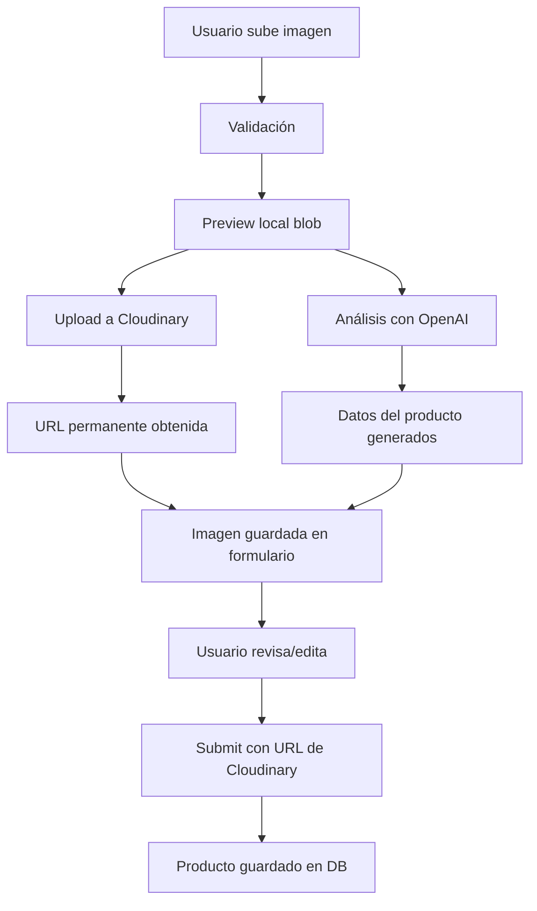

# ✅ Cloudinary Integrado - Sistema Completo

## 🎉 ¡Implementación Completada!

El sistema ahora **guarda automáticamente las imágenes en Cloudinary** cuando se crea un nuevo producto con IA.

---

## 🔄 Flujo Actual (Completo)

### Cuando subes una imagen en "Nuevo Producto":



### 1. **Upload de Imagen**
- Se valida tamaño (max 10MB)
- Se crea preview local inmediato
- Se muestra en pantalla

### 2. **Upload a Cloudinary** ⭐ NUEVO
- Sube automáticamente a Cloudinary
- Folder: `glowhair/products`
- Upload preset: `glowhair_unsigned`
- Obtiene URL permanente
- Muestra indicador de progreso

### 3. **Análisis con IA**
- OpenAI GPT-4o Vision procesa la imagen
- Genera descripción, beneficios, ingredientes, etc.
- Pre-selecciona categoría inteligentemente
- Rellena automáticamente el formulario

### 4. **Submit Final**
- Guarda producto con URL de Cloudinary
- Imagen accesible permanentemente
- No más blob URLs

---

## 📦 Cambios Implementados

### 1. `src/hooks/useCloudinaryUpload.ts`
✅ **Actualizado para upload directo a Cloudinary**

```typescript
const { uploadImage, uploading } = useCloudinaryUpload();

const cloudinaryUrl = await uploadImage(file);
// Retorna: https://res.cloudinary.com/glowhair/image/upload/v.../producto.jpg
```

**Características:**
- Upload directo sin API intermedia
- Logging detallado
- Manejo de errores robusto
- Progress tracking

### 2. `src/components/admin/AIImageUpload.tsx`
✅ **Integración completa con Cloudinary**

**Nuevas funcionalidades:**
- Upload automático a Cloudinary al seleccionar imagen
- Indicador visual separado para upload vs análisis IA
- Muestra URL de Cloudinary cuando está lista
- Deshabilita acciones durante upload
- Error handling mejorado

**Estados visuales:**
1. `isUploadingToCloud`: "Subiendo a Cloudinary..."
2. `isAnalyzing`: "Analizando con IA..."
3. `complete`: "✅ Imagen guardada en Cloudinary"

### 3. `src/app/admin/productos/nuevo/page.tsx`
✅ **Guardar URL de Cloudinary en DB**

```typescript
images: productImage?.cloudinaryUrl ? [productImage.cloudinaryUrl] : [],
```

**Antes:**
```json
{
  "images": []  // ❌ No guardaba nada
}
```

**Ahora:**
```json
{
  "images": [
    "https://res.cloudinary.com/glowhair/image/upload/v1234567/glowhair/products/gel-cacao.jpg"
  ]
}
```

### 4. `src/app/productos/page.tsx`
✅ **Ya preparado para mostrar imágenes de Cloudinary**

```typescript
// Filtra blob URLs, solo muestra URLs válidas
const validImages = apiProduct.images.filter((img: string) => 
  img && typeof img === 'string' && !img.startsWith('blob:')
);
imageUrl = validImages[0];
```

### 5. `src/components/product/ProductCard.tsx`
✅ **Ya soporta image_url**

```tsx
{product.image_url ? (
  <Image src={product.image_url} alt={product.name} />
) : (
  <div>{product.image}</div> // Fallback a ícono SVG
)}
```

---

## 🎯 Configuración Cloudinary

### Variables de Entorno (`.env.local`)
```bash
# Cloudinary Configuration
NEXT_PUBLIC_CLOUDINARY_CLOUD_NAME=glowhair
CLOUDINARY_API_KEY=624668179513197
CLOUDINARY_API_SECRET=Tu_eIn4fiwiHhW9c5pqgFrA0l2o
NEXT_PUBLIC_CLOUDINARY_UPLOAD_PRESET=glowhair_unsigned
```

### Upload Preset Configurado
- **Nombre:** `glowhair_unsigned`
- **Modo:** Unsigned (permite upload desde frontend)
- **Folder:** `glowhair/products`
- **Transformaciones:** Automáticas
- **Calidad:** Auto (optimización automática)

---

## 🧪 Cómo Probar

### 1. Reiniciar servidor
```bash
npm run dev
```

### 2. Ir a Nuevo Producto
```
http://localhost:3000/admin/productos/nuevo
```

### 3. Subir una imagen de producto
- Arrastra o selecciona una imagen
- Verás: **"Subiendo a Cloudinary..."**
- Luego: **"Analizando con IA..."**
- Finalmente: **"✅ Imagen guardada en Cloudinary"**

### 4. Verificar en consola
```
📤 Subiendo imagen a Cloudinary...
  - Cloud Name: glowhair
  - Upload Preset: glowhair_unsigned
  - File: gel-cacao.jpg (2.45 MB)
✅ Imagen subida exitosamente:
  - URL: https://res.cloudinary.com/glowhair/image/upload/v.../gel-cacao.jpg
  - Public ID: glowhair/products/gel-cacao
  - Dimensiones: 800x800
```

### 5. Guardar producto
- Revisa los datos generados por IA
- Click en **"Guardar Producto"**
- Verifica en la DB:
```json
{
  "images": [
    "https://res.cloudinary.com/glowhair/image/upload/..."
  ]
}
```

### 6. Ir a Productos
```
http://localhost:3000/productos
```
- Deberías ver la imagen real del producto
- Ya no más íconos SVG para productos nuevos

---

## 📊 Beneficios del Sistema Actual

### ✅ URLs Permanentes
- Las imágenes nunca desaparecen
- Accesibles desde cualquier lugar
- Funcionan en producción

### ✅ Optimización Automática
- Cloudinary optimiza el tamaño
- Formato WebP automático
- Carga rápida con CDN global

### ✅ Sin Server-Side Upload
- Upload directo desde el navegador
- No consume recursos del servidor
- Más rápido y eficiente

### ✅ Transformaciones On-the-Fly
Puedes modificar imágenes en la URL:
```
Original:
https://res.cloudinary.com/glowhair/image/upload/v123/producto.jpg

Thumbnail (200x200):
https://res.cloudinary.com/glowhair/image/upload/w_200,h_200,c_fill/v123/producto.jpg

Con efecto blur:
https://res.cloudinary.com/glowhair/image/upload/e_blur:300/v123/producto.jpg
```

### ✅ Backup Automático
- Cloudinary guarda tus imágenes
- No necesitas backups manuales
- Historial de versiones

---

## 🔧 Gestión de Imágenes en Cloudinary

### Ver todas las imágenes
1. Login en https://cloudinary.com/
2. Media Library
3. Folder: `glowhair/products`

### Organización
```
cloudinary/
└── glowhair/
    └── products/
        ├── gel-cacao-abc123.jpg
        ├── shampoo-xyz456.jpg
        ├── mascarilla-def789.jpg
        └── ...
```

### Estadísticas
- Dashboard muestra:
  - Total de imágenes
  - Espacio usado (25GB gratis)
  - Bandwidth usado
  - Transformaciones

---

## 📈 Límites del Plan Gratuito

| Recurso | Límite Gratuito |
|---------|----------------|
| Almacenamiento | 25 GB |
| Bandwidth | 25 GB/mes |
| Transformaciones | 25,000/mes |
| Imágenes | Ilimitadas |

**Nota:** Con optimización automática, puedes almacenar ~12,500 imágenes en 25GB (aprox 2MB cada una).

---

## 🚀 Próximos Pasos Opcionales

### 1. Múltiples Imágenes por Producto
Actualizar para permitir subir varias imágenes:
```typescript
const [productImages, setProductImages] = useState<ImageFile[]>([]);
```

### 2. Galería de Imágenes
Mostrar carousel en detalle del producto.

### 3. Compresión Pre-Upload
Optimizar en cliente antes de subir:
```typescript
import imageCompression from 'browser-image-compression';
const compressed = await imageCompression(file, { maxSizeMB: 1 });
```

### 4. Drag & Drop para Ordenar
Permitir reordenar imágenes del producto.

---

## 🐛 Troubleshooting

### Error: "Upload failed"
```bash
# Verificar variables de entorno
echo $NEXT_PUBLIC_CLOUDINARY_CLOUD_NAME
echo $NEXT_PUBLIC_CLOUDINARY_UPLOAD_PRESET

# Reiniciar servidor
npm run dev
```

### Error: "Upload preset not found"
1. Ir a Cloudinary Dashboard
2. Settings → Upload
3. Verificar que existe `glowhair_unsigned`
4. Verificar que Signing Mode = Unsigned

### Imagen no aparece en /productos
1. Verificar en DB que `images` tiene URL válida
2. Abrir URL en navegador directamente
3. Verificar que no empieza con `blob:`
4. Check consola de navegador por errores CORS

---

## ✅ Checklist Final

- [x] Cloudinary configurado en `.env.local`
- [x] Upload preset `glowhair_unsigned` creado
- [x] Hook `useCloudinaryUpload` actualizado
- [x] Componente `AIImageUpload` integrado
- [x] Formulario guarda URLs de Cloudinary
- [x] ProductCard muestra imágenes de Cloudinary
- [x] Filtrado de blob URLs implementado
- [x] Indicadores visuales de progreso
- [x] Error handling robusto
- [x] Logging detallado

---

## 🎉 Resultado Final

### Cuando crees un producto:

1. **Preview inmediato** (blob local)
2. **Upload a Cloudinary** (2-3 segundos)
3. **Análisis con IA** (5-10 segundos)
4. **URL permanente guardada** ✅
5. **Imagen visible en /productos** ✅

### En la base de datos:
```json
{
  "id": "uuid-123",
  "name": "Gel Deluxe Liss Cacao",
  "images": [
    "https://res.cloudinary.com/glowhair/image/upload/v1234567/glowhair/products/gel-cacao.jpg"
  ],
  "description": "Descubre la sofisticación...",
  "benefits": ["Brillo 4D", "Control de frizz", ...],
  ...
}
```

### En la página de productos:
```tsx
<ProductCard 
  product={{
    name: "Gel Deluxe Liss Cacao",
    image_url: "https://res.cloudinary.com/glowhair/...",
    price: 1500.00
  }}
/>
// ✅ Muestra la imagen real del producto
```

---

🎯 **Sistema completo y funcional!** Las imágenes ahora se guardan permanentemente en Cloudinary durante el proceso de creación con IA.
