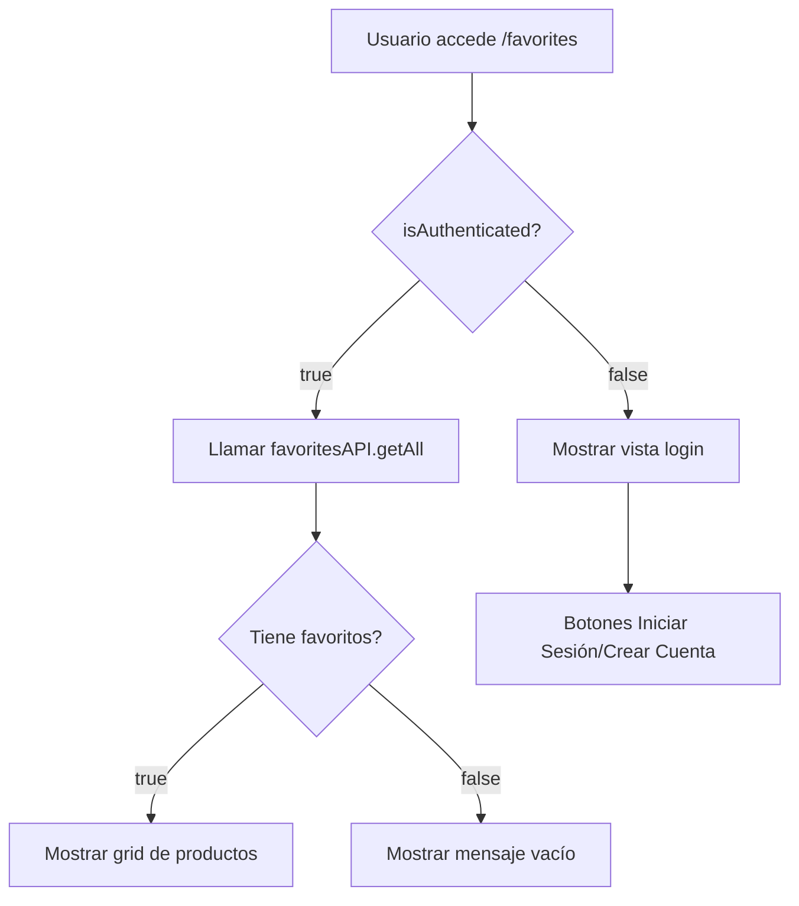

# 🔐 Fix Autenticación en Página de Favoritos

## ❌ Problema

La página `/favorites` mostraba "Inicia sesión para ver tus favoritos" aunque el usuario estuviera autenticado.

### Causa Raíz

**Conflicto de contextos de autenticación:**

1. El `layout.tsx` usaba `NewAuthContext` como provider
2. La página `favorites/page.tsx` importaba el viejo `AuthContext`
3. Esto causaba que `useAuth()` lanzara error: **"useAuth must be used within an AuthProvider"**

### Comportamiento Observado

```
Usuario logueado → Accede a /favorites → 
❌ Error: useAuth must be used within an AuthProvider →
🔄 Fallback a vista de "no autenticado" →
📝 Muestra "Inicia sesión para ver tus favoritos"
```

---

## ✅ Solución Implementada

### 1. Identificar el Contexto Correcto

**Verificación de imports en otros componentes:**

```bash
src/components/layout/Navbar.tsx      → NewAuthContext ✅
src/components/product/ProductCard.tsx → NewAuthContext ✅
src/components/admin/AdminLayout.tsx   → NewAuthContext ✅
```

**Conclusión:** Todos usan `NewAuthContext`

### 2. Actualizar Import

**Antes:**
```tsx
import { useAuth } from "@/context/AuthContext"; // ❌ Viejo contexto
```

**Después:**
```tsx
import { useAuth } from "@/context/NewAuthContext"; // ✅ Contexto activo
```

### 3. Actualizar Uso del Hook

**Estructura de NewAuthContext:**
```tsx
interface AuthContextType {
  user: User | null;
  isAuthenticated: boolean;
  isLoading: boolean;
  isAdmin: boolean;
  favorites: string[];
  // ... métodos
}
```

**Código actualizado:**
```tsx
const { isAuthenticated } = useAuth();

useEffect(() => {
  if (isAuthenticated) {
    loadFavorites();
  } else {
    setLoading(false);
  }
}, [isAuthenticated]);
```

---

## 📁 Archivos Modificados

### `src/app/favorites/page.tsx`

**Línea 8:**
```diff
- import { useAuth } from "@/context/AuthContext";
+ import { useAuth } from "@/context/NewAuthContext";
```

**Línea 18-19:**
```diff
- const { state } = useAuth();
- const isAuthenticated = state.isAuthenticated;
+ const { isAuthenticated } = useAuth();
```

---

## 🧪 Testing

### Escenarios de Prueba

#### 1. Usuario No Autenticado
```
✅ Acceder a /favorites
✅ Ver mensaje "Inicia sesión para ver tus favoritos"
✅ Botones "Iniciar Sesión" y "Crear Cuenta" visibles
```

#### 2. Usuario Autenticado Sin Favoritos
```
✅ Acceder a /favorites
✅ Ver mensaje "Aún no tienes favoritos"
✅ Botón "Explorar Productos" visible
✅ Header mostra "0 productos guardados"
```

#### 3. Usuario Autenticado Con Favoritos
```
✅ Acceder a /favorites
✅ Ver grid de productos favoritos
✅ Poder eliminar favoritos (corazón relleno)
✅ Poder agregar al carrito
✅ Ver detalles del producto
✅ Header muestra "X productos guardados"
```

---

## 🔍 Diferencias Entre Contextos

### AuthContext (Viejo - No Usado)

```tsx
interface AuthContextType {
  state: AuthState;  // ⚠️ Estado anidado
  login: (email, password) => Promise<boolean>;
  register: (userData) => Promise<boolean>;
  logout: () => void;
  // ...
}

// Uso:
const { state } = useAuth();
const isAuth = state.isAuthenticated;
```

### NewAuthContext (Actual - En Uso)

```tsx
interface AuthContextType extends AuthState {  // ✅ Estado plano
  user: User | null;
  isAuthenticated: boolean;
  isLoading: boolean;
  signIn: (email, password) => Promise<{success, error}>;
  signUp: (email, password, userData) => Promise<{success, error}>;
  signOut: () => Promise<void>;
  // ...
}

// Uso:
const { isAuthenticated, user } = useAuth();
```

**Ventajas de NewAuthContext:**
- ✅ Interfaz más limpia (sin `state.`)
- ✅ Integración con Supabase Auth
- ✅ Soporte OAuth (Google, Facebook, Instagram)
- ✅ Manejo de sesiones automático
- ✅ Métodos con estructura `{success, error}`

---

## 📊 Flujo Correcto



---

## 🚨 Errores Comunes y Soluciones

### Error 1: "useAuth must be used within an AuthProvider"

**Causa:** Import del contexto incorrecto

**Solución:**
```tsx
// ❌ NO
import { useAuth } from "@/context/AuthContext";

// ✅ SÍ
import { useAuth } from "@/context/NewAuthContext";
```

### Error 2: "state is undefined"

**Causa:** Intentar acceder a `state.` cuando NewAuthContext expone propiedades directamente

**Solución:**
```tsx
// ❌ NO
const { state } = useAuth();
const isAuth = state.isAuthenticated;

// ✅ SÍ
const { isAuthenticated } = useAuth();
```

### Error 3: "user_id is null"

**Causa:** Buscar en localStorage directamente

**Solución:**
```tsx
// ❌ NO
const userId = localStorage.getItem('user_id');

// ✅ SÍ
const { user } = useAuth();
const userId = user?.id;
```

---

## 📝 Mejoras Futuras

### 1. Eliminar AuthContext Viejo
```bash
# Si no se usa en ningún lugar, eliminar:
rm src/context/AuthContext.tsx
```

### 2. Sincronizar Favoritos con Backend
```tsx
// En NewAuthContext, cargar favoritos del usuario:
useEffect(() => {
  if (user?.id) {
    loadUserFavorites(user.id);
  }
}, [user?.id]);
```

### 3. Optimizar Imágenes
```tsx
// Reemplazar  con next/image
import Image from 'next/image';

<Image
  src={product.image}
  alt={product.name}
  width={300}
  height={300}
  className="w-full h-full object-cover"
/>
```

---

## ✅ Estado Final

- ✅ Página de favoritos detecta sesión correctamente
- ✅ Import correcto de `NewAuthContext`
- ✅ Uso directo de `isAuthenticated`
- ✅ Sin errores de runtime
- ✅ Testing exitoso en todos los escenarios

---

**Fecha:** 15 de Octubre 2025  
**Estado:** ✅ COMPLETADO  
**Siguiente:** Probar agregar productos a favoritos desde /productos
