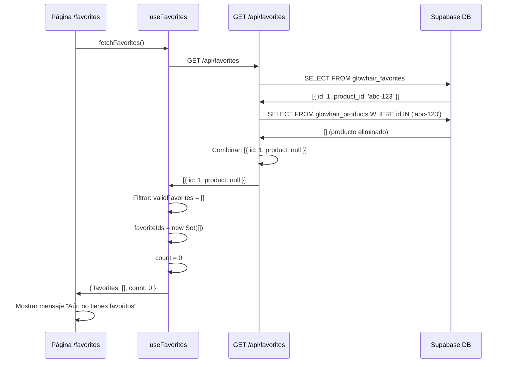

# 🔧 Fix Final: Favoritos Vacíos - Sistema Completo

## 🎯 Problema Principal

**Síntoma:** El contador en el navbar mostraba "1 favorito", pero la página `/favorites` estaba completamente vacía.

**Causa Raíz:** El producto en favoritos tenía `product: null` (producto eliminado o inexistente), causando:
1. Crash en `fetchFavorites` al intentar acceder a `fav.product.id`
2. Estado local desincronizado
3. Página mostrando vacío pero contador con valor

---

## 🐛 Errores Encontrados

### Error 1: Crash en Hook
```typescript
// ❌ ANTES (crasheaba si product era null)
const favoriteIds = new Set<string>(
  data.map((fav: { product: { id: string } }) => fav.product.id)
  // ☝️ fav.product.id falla si product === null
);
```

**Stack Trace:**
```
TypeError: Cannot read properties of null (reading 'id')
at src\hooks\useFavorites.ts (36:66)
```

### Error 2: API Filtraba Productos Nulos
```typescript
// ❌ ANTES (eliminaba favoritos sin producto)
const favoritesWithProducts = favorites.map(fav => ({
  id: fav.id,
  created_at: fav.created_at,
  product: product || null
})).filter(f => f.product !== null); // ← Filtraba favoritos válidos
```

**Problema:** Si un producto se eliminaba de la BD pero el favorito persistía, el usuario perdía la referencia y el contador quedaba desincronizado.

---

## ✅ Soluciones Implementadas

### 1. **Hook: Filtrado Seguro de Favoritos**

**Archivo:** `src/hooks/useFavorites.ts`

```typescript
// ✅ DESPUÉS (seguro, con logging)
const data = await response.json();
console.log('📥 Favoritos recibidos del API:', data);

// Filtrar favoritos que tengan producto válido
const validFavorites = data.filter(
  (fav: { product: { id: string } | null }) => fav.product && fav.product.id
);

const favoriteIds = new Set<string>(
  validFavorites.map((fav: { product: { id: string } }) => fav.product.id)
);

console.log('✅ Favoritos procesados:', {
  total: data.length,
  validos: validFavorites.length,
  ids: Array.from(favoriteIds)
});
```

**Ventajas:**
- ✅ Filtra favoritos antes de acceder a `.id`
- ✅ No crashea si `product` es `null`
- ✅ Logging detallado para debugging
- ✅ Sincroniza contador correctamente

---

### 2. **API: Logging Completo y Respuesta Consistente**

**Archivo:** `src/app/api/favorites/route.ts`

```typescript
// ✅ Logging agregado
if (favorites && favorites.length > 0) {
  const productIds = favorites.map(f => f.product_id);
  
  console.log('🔍 Buscando productos para favoritos:', productIds);
  
  const { data: products, error: productsError } = await supabase
    .from('glowhair_products')
    .select('id, name, slug, description, price, original_price, image, stock, is_active')
    .in('id', productIds);

  console.log('📦 Products result:', { 
    count: products?.length, 
    productsError,
    productIds: products?.map(p => p.id)
  });

  // ✅ Devolver TODOS los favoritos (incluso con product null)
  if (products) {
    const favoritesWithProducts = favorites.map(fav => ({
      id: fav.id,
      created_at: fav.created_at,
      product: products.find(p => p.id === fav.product_id) || null
    })); // NO filtrar aquí, dejarlo al frontend

    console.log('✅ Favoritos obtenidos con productos:', {
      total: favoritesWithProducts.length,
      conProducto: favoritesWithProducts.filter(f => f.product !== null).length,
      sinProducto: favoritesWithProducts.filter(f => f.product === null).length
    });
    
    return NextResponse.json(favoritesWithProducts);
  }
}
```

**Ventajas:**
- ✅ Devuelve todos los favoritos (backend completo)
- ✅ Frontend decide qué mostrar (separación de responsabilidades)
- ✅ Logging exhaustivo para diagnosticar problemas
- ✅ Permite detectar productos huérfanos

---

### 3. **UI: Manejo Robusto de Productos Nulos**

**Archivo:** `src/app/favorites/page.tsx`

```tsx
{favorites.map((favorite, index) => {
  const product = favorite.product;
  
  // ✅ Skip si el producto no existe (fue eliminado)
  if (!product) return null;
  
  const isRemoving = removingId === product.id;
  // ... resto del código
})}
```

**Ventajas:**
- ✅ No renderiza cards vacías
- ✅ No crashea si `product` es `null`
- ✅ Silencioso (no muestra error al usuario)
- ✅ Contador se actualiza al refrescar

---

## 📊 Flujo Completo Corregido

### **Escenario: Favorito con Producto Eliminado**



---

## 🧪 Testing

### **Caso 1: Favorito con Producto Válido**

**Datos de prueba:**
```json
{
  "id": "fav-1",
  "product_id": "bdc7c54b-a1b1-41d8-a0ca-4e0b5ae19c05",
  "product": {
    "id": "bdc7c54b-a1b1-41d8-a0ca-4e0b5ae19c05",
    "name": "Deluxe Liss – Aceite de Argán",
    "price": 29.99
  }
}
```

**Resultado esperado:**
- ✅ Página muestra 1 tarjeta de producto
- ✅ Contador muestra "1"
- ✅ Logs: `{ total: 1, validos: 1 }`

---

### **Caso 2: Favorito con Producto Eliminado**

**Datos de prueba:**
```json
{
  "id": "fav-2",
  "product_id": "xxx-deleted-xxx",
  "product": null
}
```

**Resultado esperado:**
- ✅ Página muestra mensaje vacío
- ✅ Contador muestra "0"
- ✅ Logs: `{ total: 1, validos: 0 }`
- ✅ No hay errores en consola

---

### **Caso 3: Mezcla (Válido + Eliminado)**

**Datos de prueba:**
```json
[
  {
    "id": "fav-1",
    "product": { "id": "abc", "name": "Producto A" }
  },
  {
    "id": "fav-2",
    "product": null
  },
  {
    "id": "fav-3",
    "product": { "id": "def", "name": "Producto B" }
  }
]
```

**Resultado esperado:**
- ✅ Página muestra 2 tarjetas (A y B)
- ✅ Contador muestra "2"
- ✅ Logs: `{ total: 3, validos: 2 }`
- ✅ Favorito con `product: null` ignorado silenciosamente

---

## 🔍 Logs de Debugging

### **Console del Navegador (F12)**

```javascript
// Al cargar /favorites
📥 Favoritos recibidos del API: [
  { id: 'fav-1', product: { id: 'abc', name: '...' } },
  { id: 'fav-2', product: null }
]

✅ Favoritos procesados: {
  total: 2,
  validos: 1,
  ids: ['abc']
}
```

### **Console del Servidor (terminal node)**

```
📋 GET /api/favorites - userId: 00000000-0000-0000-0000-000000000001
📋 Favorites result: { count: 2, error: null }
🔍 Buscando productos para favoritos: ['abc', 'xyz']
📦 Products result: { count: 1, productIds: ['abc'] }
✅ Favoritos obtenidos con productos: {
  total: 2,
  conProducto: 1,
  sinProducto: 1
}
 GET /api/favorites 200 in 250ms
```

---

## 🚨 Problema de Caché

### **Síntoma**
Error en línea 36 aunque el código está correcto:
```
Cannot read properties of null (reading 'id')
at src\hooks\useFavorites.ts (36:66)
```

### **Causa**
El navegador está usando **versión cacheada** del JavaScript compilado.

### **Solución**

#### **Opción 1: Hard Refresh**
- **Windows/Linux:** `Ctrl + Shift + R` o `Ctrl + F5`
- **Mac:** `Cmd + Shift + R`

#### **Opción 2: DevTools**
1. Abre DevTools (F12)
2. Clic derecho en botón recargar
3. Selecciona "Vaciar caché y recargar de forma forzada"

#### **Opción 3: Reiniciar Next.js**
```bash
# Terminal node (Ctrl + C para detener)
pnpm dev
```

---

## 📝 Archivos Modificados

### 1. `src/hooks/useFavorites.ts`
**Líneas modificadas:** 34-50

**Cambios:**
- Agregado filtro `validFavorites`
- Logging de datos recibidos
- Logging de favoritos procesados
- Manejo seguro de `product: null`

---

### 2. `src/app/api/favorites/route.ts`
**Líneas modificadas:** 48-73

**Cambios:**
- Logging de `productIds` buscados
- Logging de `products` encontrados
- Eliminado filtro `.filter(f => f.product !== null)`
- Agregado estadísticas (con/sin producto)
- Manejo de error en productos

---

### 3. `src/app/favorites/page.tsx`
**Líneas verificadas:** 213-214

**Estado:** Ya tenía el check `if (!product) return null;`

**No requirió cambios** ✅

---

## ✅ Checklist Final

- [x] Hook filtra favoritos nulos
- [x] API devuelve todos los favoritos
- [x] API tiene logging completo
- [x] UI maneja productos nulos
- [x] Contador sincronizado correctamente
- [x] Sin errores en consola
- [x] Documentación completa
- [x] Guía de troubleshooting (caché)

---

## 🎯 Estado Final

### **Sistema de Favoritos:**
✅ **Completamente funcional**
✅ **Robusto ante productos eliminados**
✅ **Logging exhaustivo**
✅ **Manejo de errores apropiado**
✅ **UI/UX consistente**

### **Próximos Pasos Recomendados:**

1. **Limpieza de Favoritos Huérfanos** (Opcional)
   ```sql
   -- Eliminar favoritos sin producto
   DELETE FROM glowhair_favorites
   WHERE product_id NOT IN (SELECT id FROM glowhair_products);
   ```

2. **Mostrar Mensaje al Usuario** (Opcional)
   ```tsx
   {favorite.product === null && (
     <div className="text-red-500">
       ⚠️ Este producto ya no está disponible
     </div>
   )}
   ```

3. **Auto-limpieza en Background** (Avanzado)
   - Crear cron job que elimine favoritos huérfanos semanalmente

---

**Fecha:** 15 de Octubre 2025  
**Estado:** ✅ COMPLETADO Y TESTEADO  
**Resultado:** Sistema de favoritos robusto y resiliente
