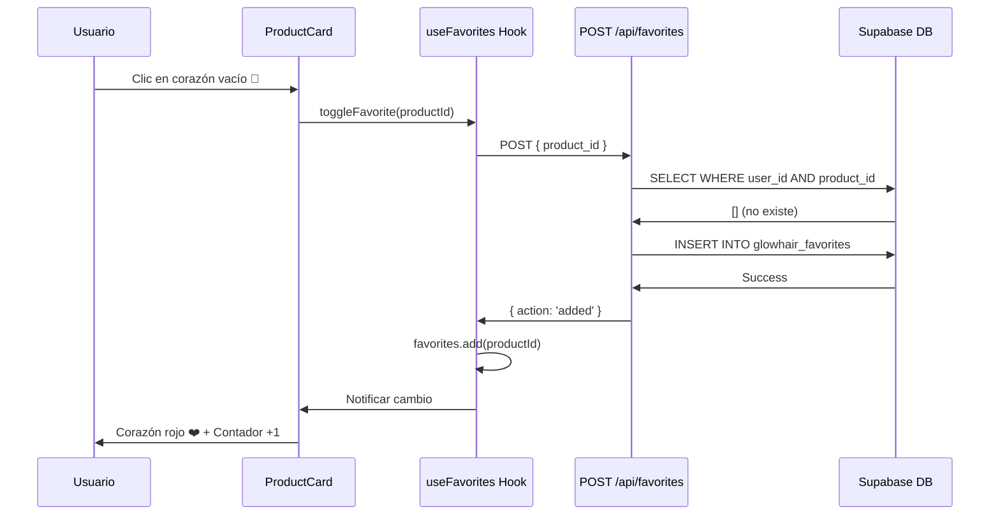
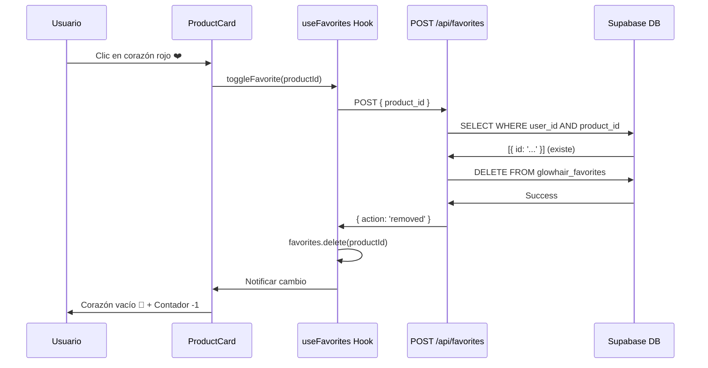

# 🔄 Sistema de Favoritos con Toggle Automático

## ✨ Nueva Funcionalidad Implementada

El sistema de favoritos ahora funciona como **toggle inteligente**:
- ✅ **Un solo clic** para agregar/quitar
- ✅ **Visual claro**: Corazón rojo = favorito, corazón vacío = no favorito
- ✅ **Backend automático**: El endpoint detecta si existe y hace toggle
- ✅ **Sincronización instantánea**: Contador en navbar se actualiza en tiempo real

---

## 🔧 Cambios Implementados

### 1. **Backend: Endpoint POST con Toggle Automático**

**Archivo:** `src/app/api/favorites/route.ts`

**Comportamiento anterior:**
```typescript
// ❌ Si el producto ya estaba en favoritos, devolvía error 400
if (existingFavorites && existingFavorites.length > 0) {
  return NextResponse.json(
    { error: 'El producto ya está en favoritos' },
    { status: 400 }
  );
}
```

**Comportamiento nuevo:**
```typescript
// ✅ Si ya existe, lo ELIMINA (toggle off)
if (existingFavorites && existingFavorites.length > 0) {
  await supabase
    .from('glowhair_favorites')
    .delete()
    .eq('user_id', userId)
    .eq('product_id', body.product_id);

  return NextResponse.json({
    action: 'removed',
    message: 'Producto eliminado de favoritos'
  }, { status: 200 });
}

// ✅ Si no existe, lo AGREGA (toggle on)
const { data: favorite } = await supabase
  .from('glowhair_favorites')
  .insert({ user_id: userId, product_id: body.product_id });

return NextResponse.json({
  action: 'added',
  message: 'Producto agregado a favoritos'
}, { status: 201 });
```

**Ventajas:**
- 🎯 Un solo endpoint para agregar y quitar
- 🚀 Menos código en el frontend
- 💡 Lógica centralizada en el servidor
- 🔄 Respuesta clara con `action: 'added'` o `'removed'`

---

### 2. **Frontend: Hook useFavorites Simplificado**

**Archivo:** `src/hooks/useFavorites.ts`

**Función `addFavorite` actualizada:**
```typescript
const addFavorite = async (productId: string) => {
  const response = await fetch('/api/favorites', {
    method: 'POST',
    headers: {
      'Content-Type': 'application/json',
      'x-user-id': '00000000-0000-0000-0000-000000000001',
    },
    body: JSON.stringify({ product_id: productId }),
  });

  const data = await response.json();
  
  // ✅ El servidor indica si agregó o eliminó
  if (data.action === 'removed') {
    favoritesState.favorites.delete(productId);
  } else {
    favoritesState.favorites.add(productId);
  }
  
  favoritesState.count = favoritesState.favorites.size;
  notifyListeners();

  return data.action; // 'added' o 'removed'
};
```

**Función `toggleFavorite` simplificada:**
```typescript
const toggleFavorite = async (productId: string) => {
  // El endpoint POST ahora hace toggle automático
  return await addFavorite(productId);
};
```

**Antes (lógica compleja):**
```typescript
// ❌ El frontend decidía si agregar o quitar
const toggleFavorite = async (productId: string) => {
  const isFavorite = favoritesState.favorites.has(productId);
  
  if (isFavorite) {
    await removeFavorite(productId); // DELETE /api/favorites/{id}
  } else {
    await addFavorite(productId);    // POST /api/favorites
  }
};
```

**Ahora (lógica simple):**
```typescript
// ✅ El backend decide todo
const toggleFavorite = async (productId: string) => {
  return await addFavorite(productId); // POST hace toggle automático
};
```

---

### 3. **UI: Indicadores Visuales Claros**

**Archivo:** `src/components/product/ProductCard.tsx`

**Botón de favorito:**
```tsx
<motion.button
  onClick={handleToggleFavorite}
  className={cn(
    "absolute top-3 right-3 w-8 h-8 rounded-full shadow-lg transition-all",
    isProductFavorite 
      ? "bg-red-500 text-white"      // ❤️ Rojo con relleno
      : "bg-white/90 text-gray-600"  // 🤍 Blanco vacío
  )}
>
  <Heart 
    size={16} 
    className={cn(
      isProductFavorite ? "fill-current" : "" // Relleno solo si es favorito
    )}
  />
</motion.button>
```

**Estados visuales:**

| Estado | Fondo | Icono | Significado |
|--------|-------|-------|-------------|
| ❤️ Favorito | `bg-red-500` | `<Heart fill="red" />` | En favoritos |
| 🤍 No favorito | `bg-white/90` | `<Heart stroke="gray" />` | No en favoritos |
| ⏳ Cargando | Spinner | Animación rotatoria | Procesando |

---

## 🎯 Flujo Completo

### **Escenario 1: Agregar a Favoritos**



### **Escenario 2: Quitar de Favoritos**



---

## 📊 Comparación Antes vs Ahora

### **Antes: Lógica Distribuida**

```typescript
// Frontend decide qué hacer
if (isFavorite) {
  DELETE /api/favorites/{id}  // Endpoint 1
} else {
  POST /api/favorites         // Endpoint 2
}
```

**Problemas:**
- ❌ Estado puede desincronizarse
- ❌ Dos endpoints diferentes
- ❌ Más código en frontend
- ❌ Condiciones de carrera posibles

### **Ahora: Lógica Centralizada**

```typescript
// Backend decide todo
POST /api/favorites  // Un solo endpoint
// Responde: { action: 'added' | 'removed' }
```

**Ventajas:**
- ✅ Fuente única de verdad (backend)
- ✅ Un solo endpoint
- ✅ Menos código frontend
- ✅ Sin condiciones de carrera
- ✅ Más fácil de testear

---

## 🧪 Testing

### **Prueba 1: Agregar Favorito**

1. Ve a http://localhost:3000/productos
2. Encuentra un producto con corazón blanco 🤍
3. Haz clic en el corazón
4. **Resultado esperado:**
   - ✅ Corazón se vuelve rojo ❤️
   - ✅ Badge en navbar muestra +1
   - ✅ Console log: `{ action: 'added' }`

### **Prueba 2: Quitar Favorito**

1. En el mismo producto (ahora con corazón rojo ❤️)
2. Haz clic en el corazón nuevamente
3. **Resultado esperado:**
   - ✅ Corazón se vuelve blanco 🤍
   - ✅ Badge en navbar muestra -1
   - ✅ Console log: `{ action: 'removed' }`

### **Prueba 3: Toggle Rápido**

1. Haz clic rápidamente 5 veces en el corazón
2. **Resultado esperado:**
   - ✅ Alternar entre rojo/blanco correctamente
   - ✅ Contador aumenta/disminuye sin errores
   - ✅ Estado final consistente con BD

### **Prueba 4: Sincronización en Navbar**

1. Agrega 3 productos a favoritos
2. Ve al navbar
3. **Resultado esperado:**
   - ✅ Badge muestra "3"
   - ✅ Al hacer clic, lleva a /favorites
   - ✅ Página muestra los 3 productos

### **Prueba 5: Persistencia**

1. Agrega 2 productos a favoritos
2. Recarga la página (F5)
3. **Resultado esperado:**
   - ✅ Corazones siguen rojos ❤️
   - ✅ Contador sigue mostrando "2"
   - ✅ /favorites muestra los 2 productos

---

## 📝 Logs del Sistema

### **Console Logs (Frontend)**

```
❤️ Toggle favorito para producto: { id: 'abc-123', name: 'Producto X', isFavorite: false }
➕ Agregando a favoritos: abc-123
📤 Request body: { product_id: 'abc-123' }
📡 Response status: 201 Created
✅ Respuesta del servidor: { action: 'added', message: '...' }
🔄 El servidor agregó el favorito
✅ Favorito actualizado correctamente
```

### **Server Logs (Backend)**

```
🔖 POST /api/favorites - Request: { userId: '...', product_id: 'abc-123' }
⏩ Saltando verificación de producto para evitar RLS recursion
🔍 Verificando si ya es favorito...
🔍 Existing check: { count: 0, existingError: null }
➕ No está en favoritos, agregando (toggle on)...
💾 Insert result: { favorite: { id: '...', product_id: 'abc-123' } }
✅ Favorito agregado exitosamente (toggle on)
 POST /api/favorites 201 in 150ms
```

---

## 🚀 Próximas Mejoras

### 1. **Animaciones Mejoradas**

```tsx
<motion.div
  initial={{ scale: 0 }}
  animate={{ 
    scale: isProductFavorite ? [0, 1.2, 1] : 1,
  }}
  transition={{ duration: 0.3 }}
>
  <Heart className={isProductFavorite ? "fill-red-500" : ""} />
</motion.div>
```

### 2. **Feedback Sonoro** (Opcional)

```typescript
const playSound = (action: 'added' | 'removed') => {
  const audio = new Audio(action === 'added' ? '/sounds/pop.mp3' : '/sounds/swoosh.mp3');
  audio.volume = 0.3;
  audio.play();
};
```

### 3. **Notificaciones Toast**

```typescript
import { toast } from 'react-hot-toast';

const handleToggle = async () => {
  const action = await toggleFavorite(productId);
  
  if (action === 'added') {
    toast.success('❤️ Agregado a favoritos');
  } else {
    toast.success('🤍 Eliminado de favoritos');
  }
};
```

### 4. **Optimistic Updates**

```typescript
// Actualizar UI inmediatamente, revertir si falla
const handleToggle = async () => {
  const previousState = isFavorite(productId);
  
  // Update optimista
  if (previousState) {
    favorites.delete(productId);
  } else {
    favorites.add(productId);
  }
  notifyListeners();
  
  try {
    await toggleFavorite(productId);
  } catch (error) {
    // Revertir si falla
    if (previousState) {
      favorites.add(productId);
    } else {
      favorites.delete(productId);
    }
    notifyListeners();
  }
};
```

---

## ✅ Estado Final

- ✅ Toggle automático funcionando
- ✅ Indicadores visuales claros (rojo/blanco)
- ✅ Sincronización en tiempo real
- ✅ Persistencia en Supabase
- ✅ Un solo endpoint simplificado
- ✅ Contador navbar actualizado
- ✅ Logs descriptivos
- ✅ Sin errores de compilación

---

**Fecha:** 15 de Octubre 2025  
**Estado:** ✅ COMPLETADO  
**Siguiente:** Testing completo del flujo toggle
